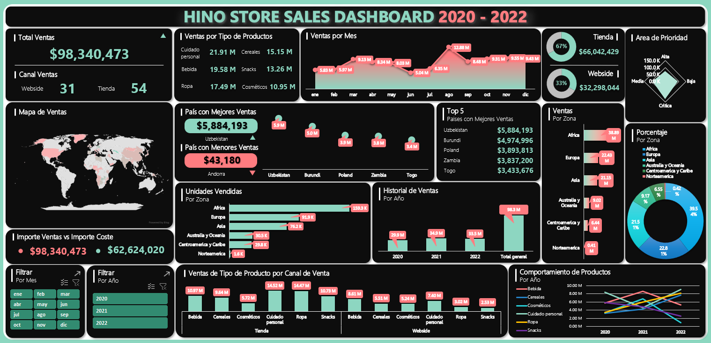

# Hino Store Sales Dashboard 2020-2022

Welcome to the Sales Data Analysis Project! This project focuses on analyzing sales data from 2020 to 2022 using Microsoft Excel.

## Project Objective

The objective of this project is to analyze sales from 2020 to 2022. So that, Hino store can understand their customers and grow sales in future years.

## Project Overview

### Data

You can see the dataset here [Store Dataset](./dataset.csv)

### Project

You can see the final project here [Project](./dashboard.xlsx)

### Conclusions

- The total sales amount is $98M
- The total cost amount is $62M
- Physical Store is the sales channel with the highest sales (67%)
- Personal care is the product type with the highest sales ($22M)
- August is the month with the highest sales ($13M)
- Uzbekistan is the country with the highest sales ($6M)
- Andorra is the country with the lowest sales ($43K)
- Africa is the continent with the highest sales quantity (159K)
- 2021 is the year with the highest sales ($35M)
- Critical is the shift priority with the highest sales quantity (129K)
